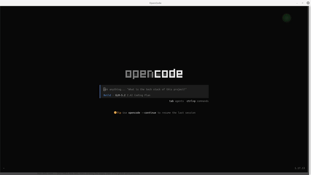
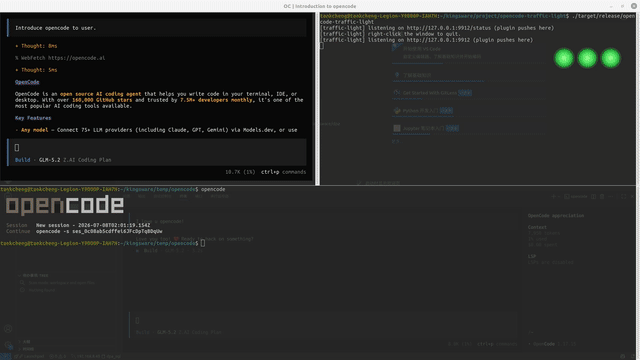
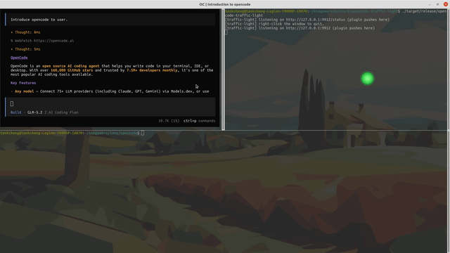

# opencode-traffic-light

[English](./README.md) | [简体中文](./README.zh-CN.md)

A floating, always-on-top traffic light widget that reflects the real-time task status of [opencode](https://opencode.ai).

> ⚠️ **Platform**: Currently tested only on **Ubuntu 20.04 (X11)**. Windows and macOS are **not supported** at this time.

- 🔴 Red: opencode is executing a task (`session.status = busy`)
- 🟡 Yellow: opencode is waiting for your input/permission (`permission.updated` pending)
- 🟢 Green: opencode has finished the task (`session.status = idle`)

## Features

- **🔴🟡🟢 Real-time status** — Red (busy) / Yellow (needs input) / Green (idle), with a pulsing animation for active states.
- **📦 Dynamic bulb count** — Automatically tracks opencode process creation and termination. Each running opencode session gets its own bulb; bulbs appear and disappear in real time as sessions start and exit. No manual configuration needed.
- **🖱️ Click to raise terminal** — Click any bulb to instantly bring the corresponding opencode terminal window to the foreground (cross-workspace, via EWMH `_NET_ACTIVE_WINDOW`). The window is matched by walking the process tree (`/proc`) and scoring window titles.
- **💬 Hover tooltips** — Hover a bulb to see the session title and current status. Tooltips appear above the bulb row and stay stable while you hover.
- **🪟 Transparent & always-on-top** — Borderless, click-through (XShape input region), stays above all windows without blocking interaction.
- **✋ Draggable** — Drag any bulb to reposition the widget.
- **🎨 Custom icons** — Right-click any bulb → "Customize Icons" to open the settings panel. Drag your own images (PNG / JPG / **animated GIF**) onto each colour to replace the default bulbs. Want a beating heart for red, a bouncing dot for yellow, or a confetti animation for green? Just drop the file in.

## Demo

### 🔴 Thinking (Red)



### 🟡 Asking for input (Yellow)


### 🖱️ Click bulb to raise terminal



### 📦 Dynamic bulb tracking (sessions appear/disappear in real time)



### 🎨 Custom icons (drag your own images or GIFs)


## Architecture

```
opencode process                   Rust monitor process
┌─────────────────────┐            ┌──────────────────────────┐
│ plugin status-pusher│   HTTP     │ tiny_http (127.0.0.1:9912)│
│  ├ event:status     │ ──POST───→ │  ├ state machine store   │
│  └ event:permission │            │  └ eframe floating window │
└─────────────────────┘            │     red/yellow/green PNG  │
                                   └──────────────────────────┘
```

- The plugin (TypeScript, ~70 lines) is auto-loaded from opencode's `.opencode/plugin/` directory. It captures `session.status` / `permission.updated` events and POSTs them to the monitor.
- The monitor (Rust, egui/eframe rendering) listens on a local port and renders a borderless, transparent, always-on-top, draggable window — supporting multiple session bulbs simultaneously.

## Installation

### Option A: Install via .deb package (recommended)

Download the latest `.deb` from [GitHub Releases](https://github.com/CuriousTank/opencode-led/releases):

```bash
sudo dpkg -i opencode-traffic-light_0.3.0_amd64.deb
sudo apt-get install -f   # auto-resolve missing dependencies
```

### Option B: Build from source (requires Rust)

```bash
cd opencode-traffic-light
cargo build --release
# Binary: target/release/opencode-traffic-light
```

Build/runtime dependency: system OpenGL library (included in most distros). No gtk/webkit required.

### Install the opencode plugin

Copy `plugin/status-pusher.ts` to either location — opencode auto-discovers it:

- **Project-level**: `<project>/.opencode/plugin/status-pusher.ts`
- **Global**: `~/.config/opencode/plugin/status-pusher.ts`

> The plugin requires `@opencode-ai/plugin` (bundled with opencode by default).

If installed via `.deb`, the plugin is available at `/usr/share/opencode-traffic-light/plugin/status-pusher.ts`.

## Usage

```bash
# 1. Launch the monitor
opencode-traffic-light          # if installed via .deb
# or
./target/release/opencode-traffic-light  # if built from source

# 2. Use opencode normally (in a project with the plugin)
opencode
```

A traffic light window will appear:
- **Drag** any bulb to move the widget
- **Click** a bulb to raise its terminal window to the foreground
- **Hover** a bulb to see the session title and status
- **Right-click** to quit

## Configuration

The default port is `9912`. Override via environment variable:

```bash
OPENCODE_TL_PORT=8899 opencode-traffic-light
```

The plugin reads the same `OPENCODE_TL_PORT` variable to determine which port to push to.

## Custom Icons

Edit the RGB values at the top of `tools/gen_icons.py`, then:

```bash
python3 tools/gen_icons.py   # regenerate assets/*.png
cargo build --release
```

## Protocol

```jsonc
// Monitor listens on 127.0.0.1:9912
// Plugin → Monitor
POST /status   { "session_id": "ses_xxx", "project": "/path", "state": "running|done|input" }
POST /remove   { "session_id": "ses_xxx" }
GET  /health   -> "ok"
```

`state` values: `running` (red) / `input` (yellow) / `done` (green).

## License

MIT
